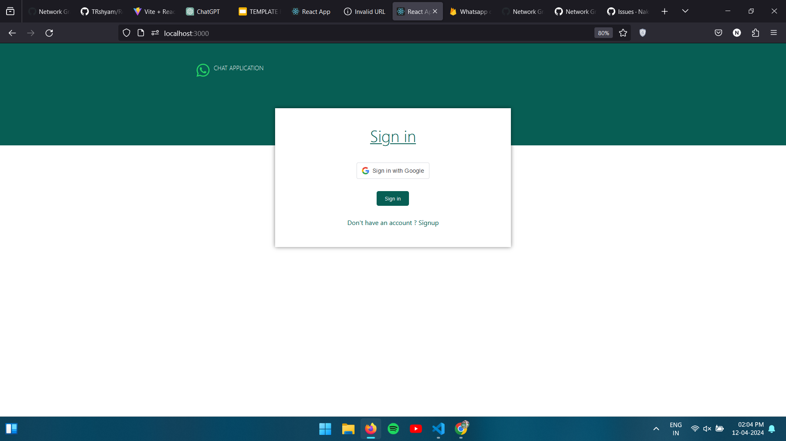
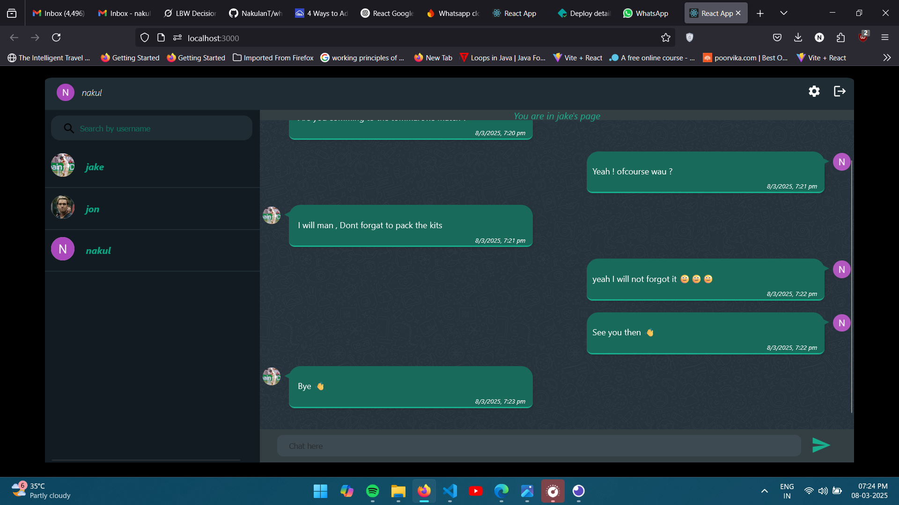

# Real-Time Chat Application README

## Overview
The Real-Time Chat Application is a web-based platform developed to enable seamless text communication between users. Built using React JS, it integrates Firebase for real-time chat storage and retrieval, and employs OAuth for secure authentication. Users sign up with a username and OAuth credentials, search for other users by username, and initiate chats by selecting a profile from the search results.

This project leverages modern web technologies to provide a simple, intuitive, and secure chatting experience.

---

## Features
- **User Authentication:** Secure sign-up and login using OAuth (e.g., Google, GitHub) with a unique username requirement.
- **Real-Time Messaging:** Stores and syncs chat messages instantly using Firebase Firestore.
- **User Search:** Allows users to find others by searching their usernames.
- **Profile-Based Chat:** Initiates a chat by clicking on a user’s profile from search results.
- **Responsive UI:** Built with React JS for a dynamic and user-friendly interface.

---

## Prerequisites
To run this project, ensure you have the following installed:
1. **Node.js** (v14+ recommended)
2. **npm** (Node Package Manager, comes with Node.js)
3. **Firebase Account** (for Firestore and Authentication setup)
4. **OAuth Provider** (e.g., Google, GitHub) configured in Firebase

### Installation
1. Clone or download this repository:
   ```
   git clone <repository-url>
   cd chat-application
   ```
2. Install the required dependencies:
   ```
   npm install
   ```
3. Set up Firebase:
   - Create a Firebase project at https://console.firebase.google.com/.
   - Enable Firestore and Authentication (OAuth provider) in the Firebase console.
   - Copy your Firebase configuration (API keys, etc.) into a `.env` file or directly into `src/firebase-config.js`:
     ```javascript
     const firebaseConfig = {
       apiKey: "your-api-key",
       authDomain: "your-auth-domain",
       projectId: "your-project-id",
       storageBucket: "your-storage-bucket",
       messagingSenderId: "your-sender-id",
       appId: "your-app-id"
     };
     ```

4. Start the development server:
   ```
   npm start
   ```
   The app will run at `http://localhost:3000`.

---

## Usage
1. **Sign Up / Login:**
   - Open the app and click "Sign Up" or "Login".
   - Authenticate using an OAuth provider (e.g., Google).
   - Provide a unique username during sign-up.

2. **Search for Users:**
   - On the home page, enter a username in the search bar.
   - Select a profile from the search results to start chatting.

3. **Chat:**
   - Send and receive messages in real-time with the selected user.
   - Messages are stored and synced via Firebase Firestore.

---

## Sample Screenshots

### Auth Page Screenshot

   - [Describe the auth page here, e.g., "The login screen with an OAuth button (e.g., 'Sign in with Google') and a username input field for sign-up."]
   - [Add more details about layout, colors, or features visible in the screenshot.]

### Home Page Screenshot

   - [Describe the home page here, e.g., "The main interface with a search bar at the top, a list of search results below, and a chat window on the right."]
   - [Add more details about layout, chat bubbles, or UI elements visible in the screenshot.]

---

## Methodology
The application follows these core processes:

1. **Authentication:**
   - Uses Firebase Authentication with OAuth to verify user identity.
   - Stores the username alongside the OAuth UID in Firestore during sign-up.

2. **User Search:**
   - Queries Firestore for usernames matching the search input.
   - Displays matching profiles for selection.

3. **Chat System:**
   - Creates a unique chat room ID for each pair of users (e.g., combining UIDs).
   - Stores messages in Firestore with timestamps and sender details.
   - Listens for real-time updates to display incoming messages.

4. **UI Rendering:**
   - React components manage the dynamic display of search results and chat messages.
   - CSS or a UI library (e.g., Material-UI) ensures a responsive design.

---

## Code Structure
- **src/**:
  - `App.js`: Main application component handling routing and layout.
  - `firebase-config.js`: Firebase initialization and configuration.
  - `components/Auth.js`: Handles OAuth login and username input.
  - `components/Home.js`: Manages search, profile selection, and chat display.
  - `components/Chat.js`: Renders the chat window and message input.

---

## Limitations
- Requires an active internet connection for Firebase syncing.
- Username uniqueness must be enforced manually in the current setup.
- Limited to text chat; no support for media (images, files) yet.
- Search performance may degrade with a large user base without optimization.

---

## Future Improvements
- Add support for media attachments (images, videos).
- Implement end-to-end encryption for message privacy.
- Optimize search with indexing or caching for scalability.
- Add offline mode with local storage for unsent messages.

---

## License
This project is for educational and experimental purposes. Ensure compliance with applicable regulations (e.g., data privacy laws) if used commercially.

---

## Contact
For questions or contributions, feel free to reach out.

---
